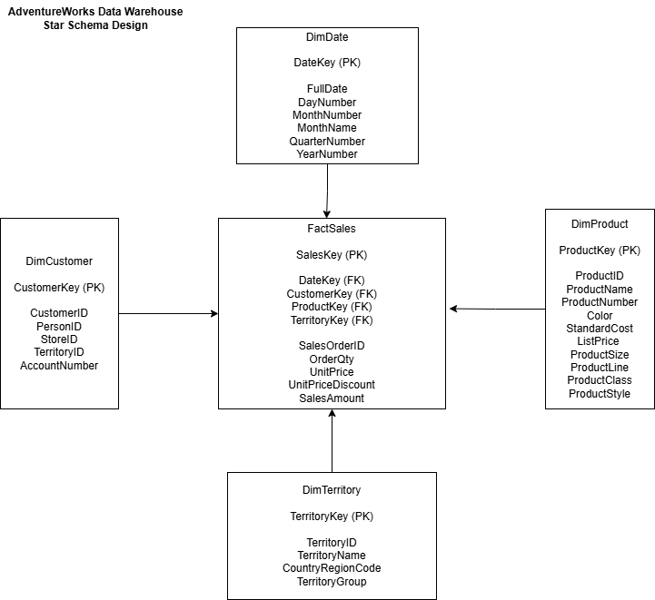
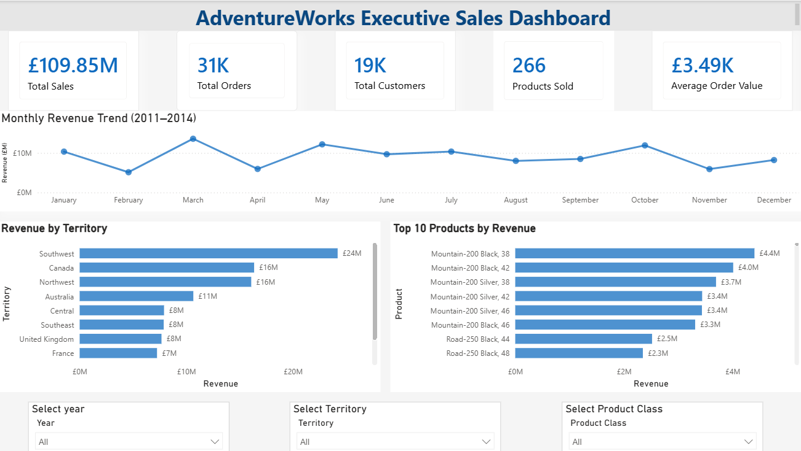
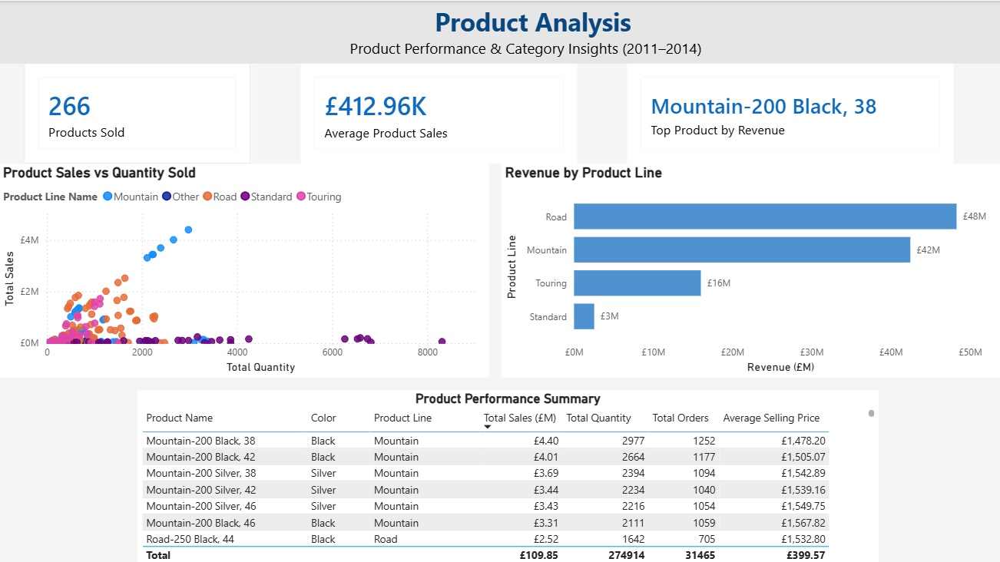
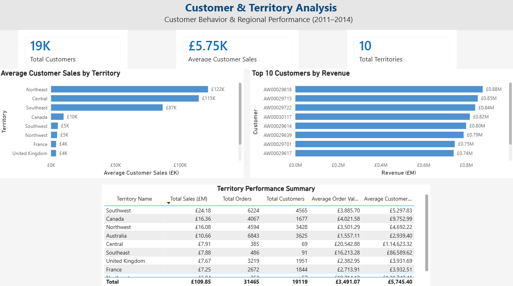

# AdventureWorks SQL Data Warehouse & Power BI Sales Analytics

## Project Overview

This project presents an end-to-end sales analytics solution built using SQL Server and Power BI.

The AdventureWorks transactional database was analysed and transformed into a dimensional data warehouse using a star schema. SQL scripts were developed to create dimension and fact tables, load data, validate the warehouse and answer business questions. The resulting model was connected to Power BI to create a three-page interactive sales dashboard.

The analysis covers sales activity from 2011 to 2014.

## Business Objectives

The project was designed to help business users monitor and analyse:

* Total sales revenue
* Total orders
* Customer performance
* Product performance
* Sales by territory
* Monthly revenue trends
* Average order value
* Average customer sales
* Top-performing products and customers

## Tools and Technologies

* SQL Server 2022
* SQL Server Management Studio
* Power BI Desktop
* Power Query
* DAX
* Dimensional Modelling
* Star Schema Design
* Draw.io

## Solution Architecture

```text
AdventureWorks OLTP Database
            |
            v
Source-System Analysis
            |
            v
SQL Server Data Warehouse
            |
            v
Star Schema Data Model
            |
            v
Power BI Sales Dashboard
```

## Source Tables

The data warehouse was developed using the following AdventureWorks source tables:

* `Sales.Customer`
* `Sales.SalesOrderHeader`
* `Sales.SalesOrderDetail`
* `Production.Product`
* `Sales.SalesTerritory`

## Data-Warehouse Design

The warehouse uses a star-schema model designed for sales analytics.

### Business Process

Sales analytics

### Grain

One row per product sold per sales-order line.

### Fact Table

* `FactSales`

### Dimension Tables

* `DimCustomer`
* `DimProduct`
* `DimTerritory`
* `DimDate`

## Star Schema



The dimension tables have one-to-many relationships with the `FactSales` table through surrogate keys.

## Key Project Results

| Metric                 |   Result |
| ---------------------- | -------: |
| Total Sales            | £109.85M |
| Total Orders           |   31,465 |
| Total Customers        |   19,119 |
| Products Sold          |      266 |
| Total Quantity Sold    |  274,914 |
| Total Territories      |       10 |
| Average Order Value    |   £3.49K |
| Average Customer Sales |   £5.75K |

## SQL Development Process

The SQL scripts are organised in execution order.

| Script                             | Purpose                                                                |
| ---------------------------------- | ---------------------------------------------------------------------- |
| `01_Source_Analysis.sql`           | Analyses source tables and records                                     |
| `02_Create_DataWarehouse.sql`      | Creates the data-warehouse database                                    |
| `03_Create_DimCustomer.sql`        | Creates the customer dimension                                         |
| `04_Create_DimProduct.sql`         | Creates the product dimension                                          |
| `05_Create_DimTerritory.sql`       | Creates the territory dimension                                        |
| `06_Create_DimDate.sql`            | Creates the date dimension                                             |
| `07_Create_FactSales.sql`          | Creates the sales fact table                                           |
| `08_Load_Dimensions.sql`           | Loads customer, product and territory dimensions                       |
| `09_Load_DimDate.sql`              | Generates and loads date records                                       |
| `10_Load_FactSales.sql`            | Loads sales transactions into the fact table                           |
| `11_Validation_Queries.sql`        | Validates row counts, relationships and sales totals                   |
| `12_Business_Analysis_Queries.sql` | Answers product, customer, territory and time-based business questions |

All SQL scripts are available in the [`sql`](sql) folder.

## Power BI Dashboard

The Power BI report contains three analytical pages.

### 1. Sales Overview

The Sales Overview page provides an executive summary of business performance.

It includes:

* Total sales
* Total orders
* Total customers
* Products sold
* Average order value
* Monthly revenue trend
* Revenue by territory
* Top 10 products by revenue
* Year, territory and product-class filters



### 2. Product Analysis

The Product Analysis page evaluates product performance using both revenue and sales-volume measures.

It includes:

* Products sold
* Average product sales
* Top product by revenue
* Product sales versus quantity sold
* Revenue by product line
* Product-level performance summary
* Total sales, quantity, orders and average selling price



### 3. Customer & Territory Analysis

The Customer and Territory Analysis page examines customer value and regional performance.

It includes:

* Total customers
* Average customer sales
* Total territories
* Average customer sales by territory
* Top 10 customers by revenue
* Territory-level sales, orders and customer summary



## Important DAX Measures

```DAX
Total Sales =
SUM(FactSales[SalesAmount])
```

```DAX
Total Orders =
DISTINCTCOUNT(FactSales[SalesOrderID])
```

```DAX
Total Customers =
DISTINCTCOUNT(FactSales[CustomerKey])
```

```DAX
Total Quantity =
SUM(FactSales[OrderQty])
```

```DAX
Average Order Value =
DIVIDE(
    [Total Sales],
    [Total Orders],
    0
)
```

```DAX
Average Customer Sales =
DIVIDE(
    [Total Sales],
    [Total Customers],
    0
)
```

## Key Insights

* The Southwest territory generated the highest revenue at approximately £24.18M.
* Road products generated the highest product-line revenue at approximately £48M.
* Mountain products generated approximately £42M in revenue.
* `Mountain-200 Black, 38` was the highest-revenue product at approximately £4.40M.
* Customer value varied significantly between territories.
* Some territories generated high total revenue through large customer volumes, while others produced higher average sales per customer.

## Repository Structure

```text
adventureworks-sql-data-warehouse-powerbi
│
├── documentation
│   ├── Business_Requirements.docx
│   ├── Source_System_Analysis.docx
│   ├── Star_Schema_Design.docx
│   ├── Star_Schema.drawio
│   └── Star_Schema.png
│
├── power-bi
│   └── AdventureWorks_Dashboard.pbix
│
├── screenshots
│   ├── 01_Sales_Overview.png
│   ├── 02_Product_Analysis.png
│   └── 03_Customer_Territory_Analysis.png
│
├── sql
│   ├── 01_Source_Analysis.sql
│   ├── 02_Create_DataWarehouse.sql
│   ├── 03_Create_DimCustomer.sql
│   ├── 04_Create_DimProduct.sql
│   ├── 05_Create_DimTerritory.sql
│   ├── 06_Create_DimDate.sql
│   ├── 07_Create_FactSales.sql
│   ├── 08_Load_Dimensions.sql
│   ├── 09_Load_DimDate.sql
│   ├── 10_Load_FactSales.sql
│   ├── 11_Validation_Queries.sql
│   └── 12_Business_Analysis_Queries.sql
│
└── README.md
```

## How to Run the Project

1. Download and restore the Microsoft AdventureWorks2022 sample database in SQL Server.
2. Open SQL Server Management Studio.
3. Execute the scripts in the `sql` folder in numerical order.
4. Confirm that the validation queries complete successfully.
5. Open `AdventureWorks_Dashboard.pbix` from the `power-bi` folder.
6. Update the SQL Server data-source connection if required.
7. Refresh the Power BI model.

## Dataset Note

The original `AdventureWorks2022.bak` database backup is not included in this repository because of its file size.

AdventureWorks is a publicly available Microsoft sample database and can be downloaded separately before running the SQL scripts.

## Project Files

* [View SQL Scripts](sql)
* [View Project Documentation](documentation)
* [View Dashboard Screenshots](screensorts)
* [Download Power BI Report](https://github.com/rahulchhabra039/adventureworks-sql-data-warehouse-powerbi/releases/latest/download/AdventureWorks_Dashboard.pbix)


  


## Author

**Rahul Chhabra**

* GitHub: [rahulchhabra039](https://github.com/rahulchhabra039)
* LinkedIn: [Rahul Chhabra – Data Analyst](https://www.linkedin.com/in/rahul-chhabra021-data-analyst/)

